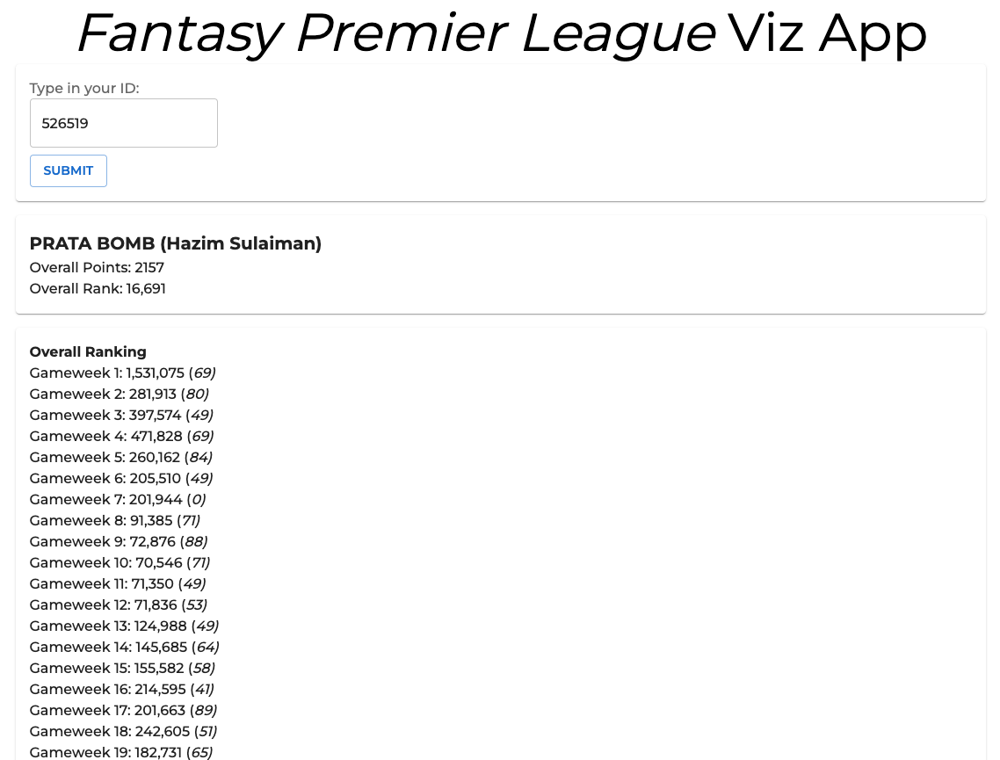
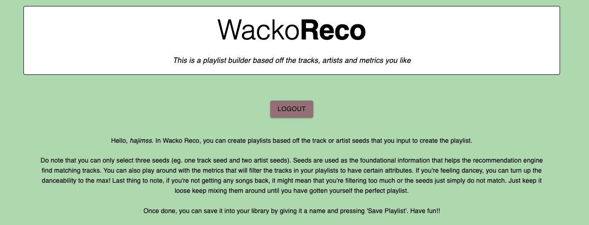
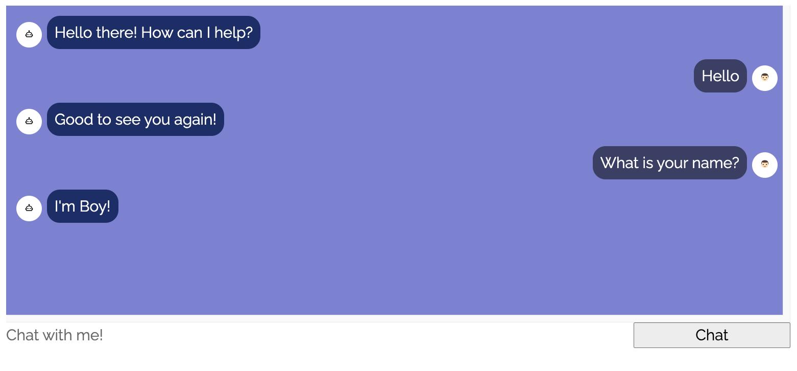

## Fantasy Premier League Viz
A website for Fantasy Premier League players to see their performance in charts throughout the season. Users can also browse through important stats that can help them make better decisions for their upcoming gameweek.
- 
- Tags: Fpl Viz
- Badges:
- Buttons:
  - Link [https://fpl-viz.web.app/]

## Wacko Reco
Had some fun using Spotify's API and used the recommendation endpoint to recommend users a playlist based off the seeds and metrics that they had chosen.
- 
- Tags: Category 2
- Badges:
- Buttons:
  - Link [http://wacko-reco.hazim.net/]

## ChatBoy
Delved into the field of machine learning and setup this chatbot by creating a Neural Networks model. Intents are created by pairing the input patterns to the respective responses. These intents are then used to train the model.
- 
- Tags: Category 2
- Badges:
- Buttons:
  - Link [https://chatboy2020.herokuapp.com/]
